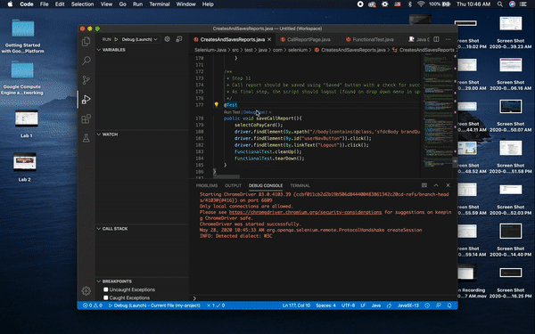
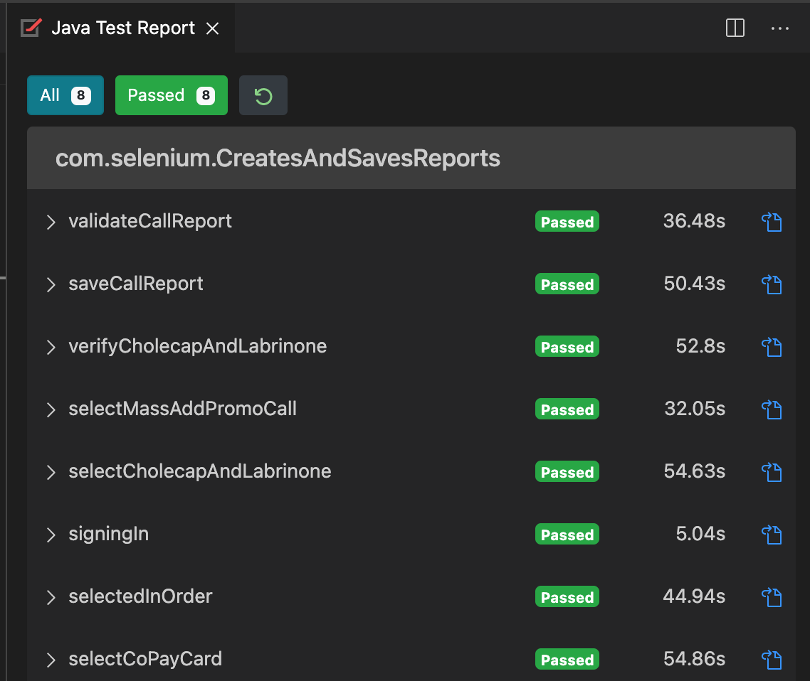

# CRM-Automation
Java Selenium Framework done in Page Objects Pattern from scratch

I've develop some automation code from scratch against the Salesforce CRM application to gain insight and a feel for what's involved with automation development for this application in a web browser.

The main goal here is to have a working script that tests the given steps. 

Automation Script Steps

          1. Log-in to application from a web browser (e.g. Internet Explorer, Firefox, Chrome, etc.).
          2. Navigate to "My Accounts" using tab near top of home page.
          3. Select "Adams, Bob" from the My Accounts list.
          4. Near the top of the Account page is a "Record A Call" button. Select this button.
          5. Validate the Call Report page is displayed.
          6. On Call Report page, select "Mass Add Promo Call" from the Record Type drop down list.
          7. On Call Report page, the script should select Cholecap and Labrinone in Detail Priority section.
          8. Under Call Discussions section, make sure a subsection appeared for both Cholecap and Labrinone. Also make sure the "Product" fields are set to the respective product (one should be set to Cholecap, the other should be set to Labrinone).
          9. On the same Call Discussion section, make sure each section appears in order the product was selected. If Labrinone was selected first, then Labrinone should show up first (from top down) under Call Discussion section.
          10. In Samples and Promotional Items section, select "QNASL Co-Pay Card", and change quantity to 2.
          11. Call report should be saved using "Saved" button with a check for successful submission. As final step, the script should logout (found on drop down menu in upper right).
          
 

Screen Recording 2020-05-26 at 3.21.47 AM.mov

 

Before running the script(CreatesAndSavesReports.java)

          1. Clone this repo
          2. Ensure chromedriver is up-to-date with chrome browser and in the proper location
          2. Click run test in the CreatesAndSavesReports.java
------------------------------------------------------------------------------------------------------------------------

2.12.2021 Test Run #1
Failed Testcases

------------------------------------------------------------------------------------------------------------------------

2.12.2021 Test Run #2
 

------------------------------------------------------------------------------------------------------------------------

4.16.2021 Test Run #3
Passing Testcases
 

------------------------------------------------------------------------------------------------------------------------

Debug Prints

